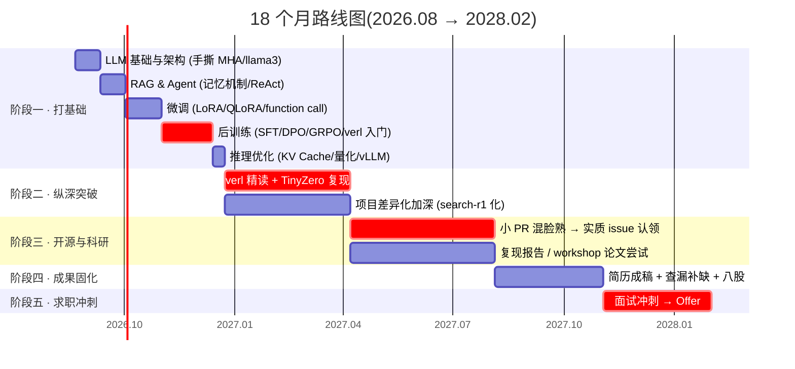

<div align="center">

# 🚀 LLM Journey

**从零到 Agentic RL 工程师的自学实录**

*一个广告算法工程师用 18 个月、约 1500 小时,系统性地转型大模型后训练 / Agentic RL 方向的全过程——*
*每一行代码、每一张训练曲线、每一次踩坑,全部公开。*

[]()
[]()
[]()
[]()
[]()
[]()

*先跑起来,再谈懂。*

</div>

---

## 🧭 这是什么

这不是一个教程仓库,而是一份**公开执行的转型计划**。

我是一名 26 届广告算法工程师,工作中接触真实的 AI 多 agent 系统,但我的目标方向是 **Agentic RL / 大模型后训练**。这个仓库记录我如何用 18 个月(2026.08 → 2028.02)、每周约 20 小时的业余时间,完成从学过到做过到被社区看见的三级跳:

| 阶段 | 目标 | 一句话 |
|---|---|---|
| **学过** | LLM 基础 → SFT/DPO/GRPO 全链路实操 | 手撕 Attention / LoRA / GRPO loss,白板级 |
| **做过** | 基于 verl 复现 TinyZero(R1-Zero 式训练) | 训练曲线公开可查,Aha moment 有截图有分析 |
| **被看见** | 给主流 RL 框架贡献代码 + 技术博客 | PR 被合并 + 复现博客成为敲门砖 |

> 💡 这个仓库是我的"**第二简历**":面试官可以在这里看到我每一步是怎么走的——包括卡壳和走弯路的部分。我认为真实的学习轨迹比完美的结果展示更有说服力。

---

## 🗺️ 路线图



<details>
<summary><b>📊 三条主线与 1500h 预算分配</b>(点击展开)</summary>

**三条主线(并行推进,不同阶段权重不同):**

- **主线 A · 基础与理论** — 解决"面试八股 + 技术全景图"
- **主线 B · 项目沉淀** — 解决"简历上有什么"(本仓库的主角)
- **主线 C · 开源与科研** — 解决"差异化与天花板"

| 板块 | 小时 | 占比 |
|---|---:|---:|
| 主线 A:体系化学习 | 480h | 32% |
| 主线 B:项目(复现 + 加深 + 工作沉淀) | 520h | 35% |
| 主线 C:开源贡献 + 论文 + 前沿 follow | 320h | 21% |
| 面试准备(八股 / LeetCode / 模拟面) | 180h | 12% |

</details>

---

## 📈 里程碑看板

> 进度随实际推进更新。✅ 已达成 · 🔨 进行中 · ⬜ 未开始

### 阶段 0 · 启动冲刺(2026.08.21 → 09.06)

- [ ] ✅ 环境就绪:双平台(公司 conda + AutoDL)+ 本 repo 建立
- [ ] 🔨 Qwen2.5-0.5B CPU 推理跑通第一句生成
- [ ] ⬜ 手撕 MultiHeadAttention,与 `torch.nn.MultiheadAttention` 对拍通过
- [ ] ⬜ llama3 四件套(GQA / RoPE / SwiGLU / RMSNorm)代码级理解
- [ ] ⬜ HF 后训练作业完成归档
- [ ] ⬜ 🚩 **Day 10(8.30):第一张 SFT 训练曲线**(full + LoRA 对比)
- [ ] ⬜ InstructGPT 四阶段 + RM 数据构造闭卷复述
- [ ] ⬜ GRPO vs PPO 三大改进点 / LoRA 前向手撕
- [ ] ⬜ MHA 10 分钟白板默写达标(录像自检)

### 阶段 1 · 九月:DPO + GRPO 启动(2026.09.07 → 09.30)

- [ ] ⬜ DPO 通关:理论推导 → TRL 实操 → win-rate 评测
- [ ] ⬜ 🚩 **Day 29(9.19):第一组 GRPO reward 曲线**
- [ ] ⬜ GRPO loss 手写(组内标准化优势 + clip + KL 逐项)
- [ ] ⬜ aha moment 观察:翻找 self-reflection 样本("Wait, let me...")

### 国庆冲刺块(2026.10.01 → 10.08)

- [ ] ⬜ GRPO 消融实验 ×2(单变量:reward 设计 / 数据难度 / 基座规模)
- [ ] ⬜ 重磅博客:《从 SFT 到 GRPO:我的 R1-Zero 复现与消融实录》

### 2026 Q4 → 2027 Q1

- [ ] ⬜ GRPO 从零手写版与 TRL 结果对比验证
- [ ] ⬜ 开源 PR #1(ms-swift / TRL)
- [ ] ⬜ DeepSeek-R1 论文精读 + 与自己实验对照
- [ ] ⬜ verl 架构白板级(能画出 worker 架构 + 一次 GRPO step 完整数据流)
- [ ] ⬜ minimind 全流程通关(pretrain / SFT / DPO / GRPO / 蒸馏)
- [ ] ⬜ 🚩 **TinyZero 复现(Qwen2.5-3B + countdown,复现 Aha moment)**

### 更远处的灯塔

- [ ] ⬜ ≥3 个 PR 合并进 star > 1k 的项目(含 ≥1 个实质贡献)
- [ ] ⬜ 技术博客 ≥3 篇,至少 1 篇有社区互动
- [ ] ⬜ 论文笔记库 ≥40 篇,Agentic RL 子方向技术脉络图
- [ ] ⬜ 🎯 拿到 Agentic RL / 后训练方向 Offer(2028.02)

---

## 📂 目录结构

```
llm-journey/
├── notes/              # 学习笔记 —— llama3 四件套、InstructGPT 精读、GRPO 推导……
│   ├── attention/      #   MHA 手撕 + 对拍记录
│   ├── papers/         #   论文精读笔记(固定格式:问题→方法→trick→复现难度→可借鉴点)
│   └── ...
├── experiments/        # 实验 —— 每个实验一个子目录,含配置快照与 run log
│   ├── day1_first_inference.py
│   ├── sft_run1/       #   🚩 第一张训练曲线(full vs LoRA)
│   ├── dpo/            #   DPO:官方 example → UltraFeedback 子集 → win-rate 评测
│   ├── grpo/           #   GRPO:GSM8K 子集 + 自定义 reward(格式 + 正确性)
│   └── tinyzero/       #   (即将开始)verl + countdown 复现
├── weekly/             # 周报 + blockers.md —— 卡壳 30 分钟即记录,绝不死磕
├── setup/              # 双平台环境脚本(setup_autodl.sh / setup_company.sh)
└── README.md           # 你在这里
```

<details>
<summary><b>⚙️ 双平台算力策略</b>(点击展开)</summary>

| 平台 | 定位 | 用途 |
|---|---|---|
| 公司 conda 平台(CPU) | **免费,主力** | 读码、笔记、数据处理、0.5B 级推理、开发调试 |
| 公司 V100-32G | 需排队 | 0.5B–1.5B 的 SFT/DPO/GRPO(注意:仅 fp16,无 flash-attention) |
| AutoDL 4090 / 8×A100 | 付费 | verl 多卡、TinyZero 复现，周五备料、周六开机即跑、**用完立刻关机** |
| 本地 Mac | 遥控器 | 写码 / 写作 / ssh,不跑实验 |

</details>

---

## 🛠️ 技术栈

<table>
<tr><td valign="top" width="50%">

**基础与微调**
- PyTorch · Transformers
- PEFT(LoRA / QLoRA / P-Tuning)
- ms-swift · LLaMA-Factory
- TRL(DPOTrainer / GRPOTrainer)

**后训练与 RL**
- GRPO / PPO / DPO(手写 + 框架双轨)
- RLFromScratch(从零手写参考)
- verl(HybridFlow 架构)
- TinyZero(R1-Zero 式复现)

</td><td valign="top" width="50%">

**模型与数据**
- Qwen2.5 系列(0.5B / 1.5B / 3B / 7B)
- minimind(26M 全流程)
- GSM8K · UltraFeedback · ModelScope

**工程与观测**
- Git · conda reproducible 环境
- swanlab / wandb 实验追踪
- vLLM(推理)· HuggingFace Hub

</td></tr>
</table>

---

## 🧪 实验记录

> 每个实验遵循固定格式:**动机 → 配置 → 曲线 → 分析 → 踩坑**。训了 ≠ 有效,评测才是关键一课。

| # | 实验 | 模型 | 状态 | 关键产出 |
|---|---|---|---:|---|
| 001 | 第一次推理对话 | Qwen2.5-0.5B | 🔨 | `day1_first_inference.py` |
| 002 | 手撕 MHA + 官方对拍 | - | ⬜ | `attention.ipynb`(float64 对拍) |
| 003 | SFT:full vs LoRA | Qwen2.5-0.5B | ⬜ | 第一张训练曲线 + 显存/速度对比 |
| 004 | DPO + win-rate 评测 | Qwen2.5-0.5B | ⬜ | rewards/margins 曲线 + 评测报告 |
| 005 | GRPO on GSM8K | Qwen2.5-0.5B | ⬜ | reward 曲线 + aha case study |
| 006 | GRPO 消融 ×2 | 0.5B / 1.5B | ⬜ | 单变量对比分析 |
| 007 | GRPO 从零手写 | - | ⬜ | `grpo_from_scratch.py` |
| 008 | TinyZero 复现 | Qwen2.5-3B | ⬜ | Aha moment 复现 + 变体实验 |

---

## ✍️ 博客与输出

*复现 repo 和博客就是敲门砖。公开写作是本计划的一等公民,不是附属品。*

| 日期 | 标题 | 链接 |
|---|---|---|
| 计划中 | 《两周从零到 SFT 跑通》 | - |
| 计划中 | 《从 SFT 到 GRPO:我的 R1-Zero 复现与消融实录》 | - |
| 计划中 | 《verl 架构拆解》 | - |
| 计划中 | 《TinyZero 复现实录:踩坑与 Aha moment 观察》 | - |

---

## 📜 执行准则

> 这个计划最大的敌人不是难度,是烂尾。所以先立法:

1. **每周产出可见物。** 
2. **30 分钟规则。** 任何卡壳超 30 分钟 → 记进 `weekly/blockers.md` → 切换任务。
3. **30 分钟保底模式。** 累垮的天,最低限度复习一个概念并闭卷复述录音。**链条不断比单日强度重要。**
4. **周五晚三问周报。** 本周产出物清单(实物!)/ 卡壳点与解法 / 下周三大事。
5. **月度滚动复盘。** 每月最后一个周日:验收清单打勾 → 闭卷自测 10 题 → 生成下月 daily 计划。
6. **砍单有顺序。** 落后超 2 周时:推理引擎细节 → 博客 → 论文数量。**永不砍:** 周六大实验、月度复盘。

<details>
<summary><b>🎯 为什么是 Agentic RL?</b>(点击展开)</summary>

我的日常工作恰好覆盖多 agent 系统的记忆与反思模块,这个仓库负责补齐:从手撕 Attention 开始,经过 SFT / DPO / GRPO 的完整实操,最终抵达基于 verl 的 R1-Zero 式训练复现与开源贡献。

两条线在 2027 年交汇,那就是我简历的样子。

</details>

---

## 🤝 交流

- 发现我的笔记或代码有错误?**欢迎开 issue 指出**——被纠正也是学习的一部分
- 同样在转型 LLM / 后训练方向?欢迎交流学习路径与踩坑经验
- 相关方向有合作想法(复现 / 评测 / 开源)?欢迎联系

<div align="center">

---

**⭐ 如果这个仓库对你的学习规划有参考价值,点个 Star 让我知道**

*Roadmap · Experiments · Notes · Weekly Reports — all in public.*

**2026.08.21 → 2028.02 · Day 1 of 547**

</div>
